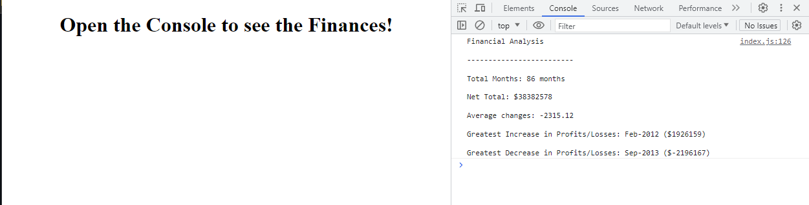

# Console-Finances
This is a console-finance showing an overview of the overall budget of a certain project. 

## Description
This repository shows the concepts learned in JavaScript fundamentals and using this concpet to address a real world problem/example. This task was to show how to analyze the financial records of a project with a fixed dataset provided and using that information to get the overview of the finances.

## Usage
This repository can be used to show the overview of finances of a project and the code can be used as a reference on what to do to get net total, average, highest value, etc. 

## Instructions
To get the console finances output, from the webpage, right click to get the DevTool in your browser by hitting right click on the mouse and hit inspect to get the DevTool. Or just hit F12 on PC to instantly get your DevTool open and make sure that you are on the console element. 

## License
License is under MIT. Please refer to the LICENSE in the repository.